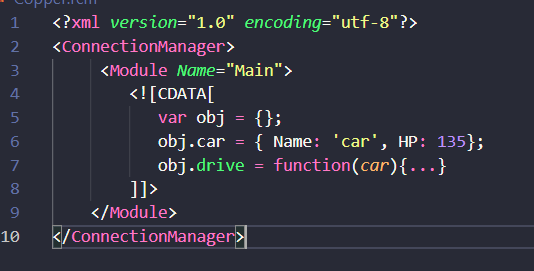

## Features

Enables JS highlighting inside XML. For the extension to work your JS has to be inside \<\!\[CDATA\[ and closed with \]\]\> 

## Installation

1. Slap an npm install while in the home directory
2. Build the C# project located in the server directory
3. Open the directory in VS Code and try running in debug (press F5)
4. Open any mixed XML file
5. There should be JS highlighting and XML suggestions
6. If there isn't, good luck ¯\\_(ツ)\_/¯

## Debugging

1. Start the extension (press F5)
2. In VS attach the process to dotnet (there is probably some way to track which PID is the correct one, good luck)
3. Now open an .rcm file and stuff should be happening

## Extension Settings

Change the regex located inside syntaxes/rcm.tmLanguage.json to modify the opening and closing matches for your javascript blocks.
