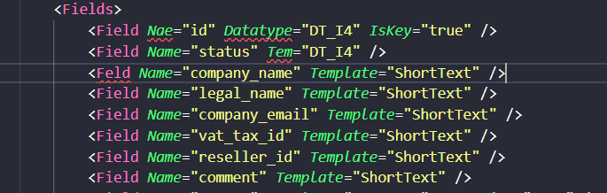
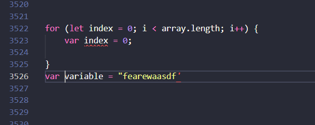

## Features

Enables JS highlighting inside XML. For the extension to work your JS has to be inside \<\!\[CDATA\[ and closed with \]\]\> 

Error correction for your XML 

Error correction for your JS 

As well as:

1. Template completions based on declared field names
2. XML completions of often used elements
3. Some JS completion
4. Warnings on the JS to keep your code sueaky clean
5. Highlighting of JS inside {{= HERE }}

## Installation

1. Slap an npm install while in the home directory
2. Build the C# project located in the server directory
3. Open the directory in VS Code and try running in debug (press F5)
4. Open any mixed XML file
5. There should be JS highlighting and XML suggestions
6. If there isn't, good luck ¯\\_(ツ)\_/¯

## Installation 2.0

1. Install the VSIX
2. If your VS Code still works, great job

## Debugging

1. Start the extension (press F5)
2. In VS attach the process to dotnet (there is probably some way to track which PID is the correct one, good luck)
3. Now open an .rcm file and stuff should be happening

## Extension Settings

Change the regex located inside syntaxes/rcm.tmLanguage.json to modify the opening and closing matches for your javascript blocks.

Btw, for the JS completion suggestions to work this file structure is required (from the "install" parent dir on, the important structure is that JS and REST are in the same directory):
D:/software/install/REST/iAmWorkingOnThisCurrently.rcm
D:/software/install/JS/module1.js
D:/software/install/JS/module2.js